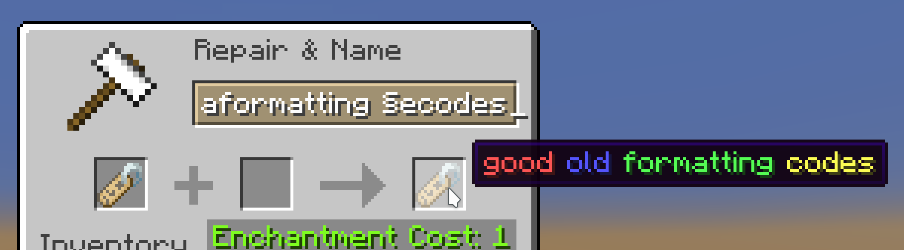
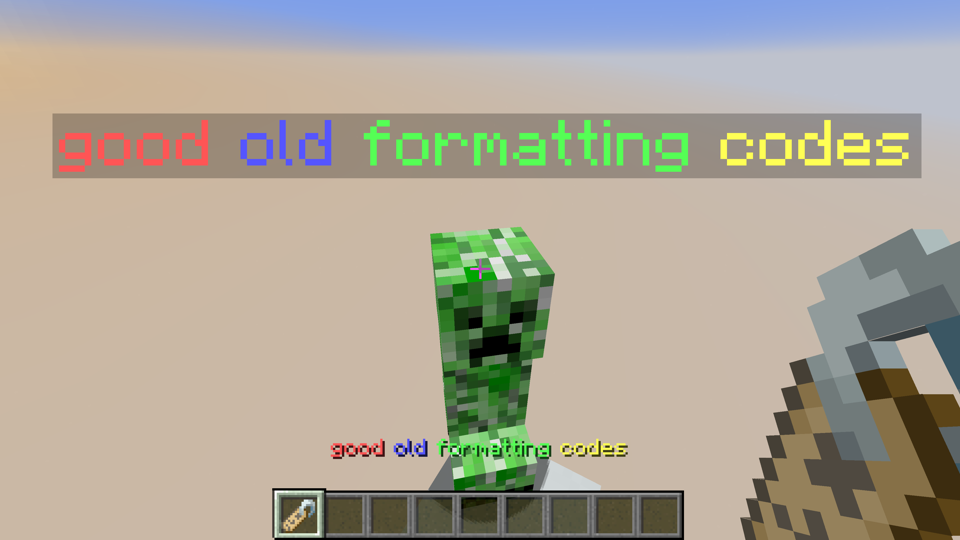

#  u00a7

Brings back the good old formatting codes.





## Usage

Simply type or copypaste your favorite formatting codes and it just works for chatting, books, signs, anvils, etc.

Additionally, you can use **Ctrl+&** or **Ctrl+7** to type formatting symbols (i.e. section signs, §) easily and swiftly.

\[WIP\] All features are toggleable in the configuration screen, which can be entered through [mod menu](https://github.com/TerraformersMC/ModMenu).

**Configuration screen is still work in progress.**

## Installation

**Minecraft 1.19 and the latest Fabric Loader is required.**

**Support for other versions is still work in progress.**

The mod needs to be installed on client-side.

In multiplayer, the server must accept packets that contains formatting codes otherwise the player will be kicked. Signs with formatting codes also need particular server-side support. You may either install mods or plugins that unlocks formatting codes (e.g. u00a7 :P) on the server-side or use servers that ship with no builtin formatting codes bans (e.g. any vanilla server before 1.14).

## Build

```sh
./gradlew build
```

Built jar is located in `build/libs/`.

## License

MPL-2.0
